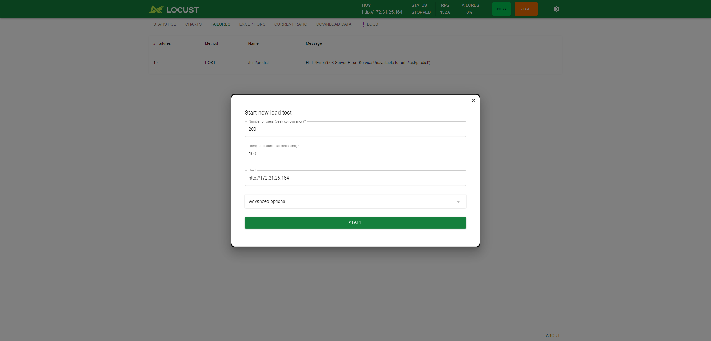
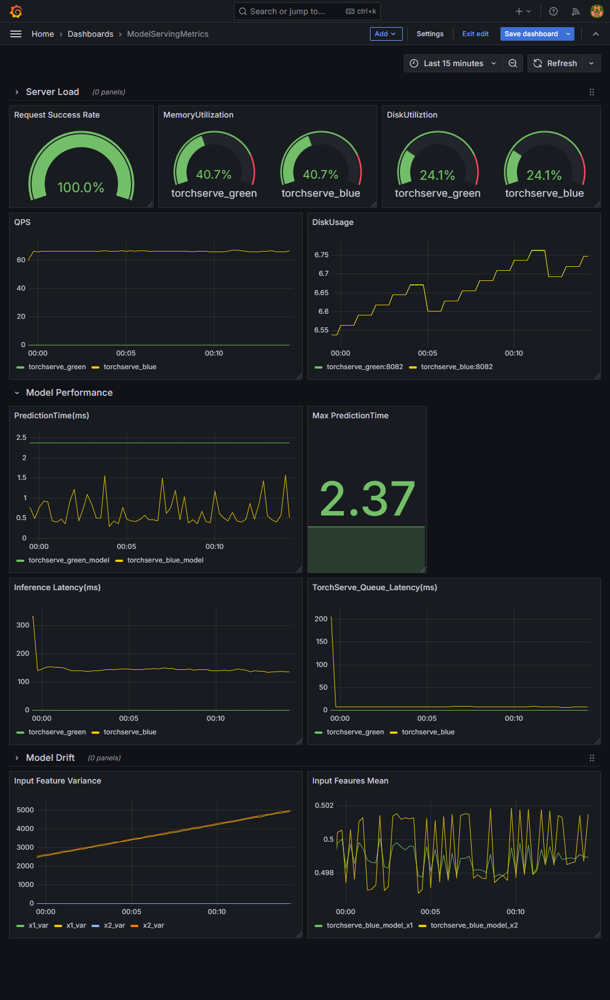

## Introduction

This project is about build a dockerized infrastructure on a single node HTTP server to serve and monitor a simple machinel learning model.


## Contents

- `assets/`: images and screenshots
- `config/`: config files mounted in Docker volume
  - `nginx/`: config file for nginx
    - `nginx.conf`: config router to blue/green environment and rate limiting
  - `grafana/`: config file for grafana
    - `dashabords\`: pre-build grafana dashboards in json
    - `datasource.yml`: define data sources from prometheus
    - `dashboards.yml`: define databoard path
  - `prometheus/`: config files for Prometheus
    - `prometheus.yml`: define datasources
    - `alert_rules.yml`: define alertings
- `emulator/`: simulate user input, and kafka topic producing training data
  - `kafka/`: kafka data streaming of training data
  - `locust/`: generate user inputs to the model api in test enviroment
- `scripts/`: automate scripts e.g.swap deploy enviroment
- `torchserve/`: models and torchserve configs
  - `model.py`: mle delivery of model structure
  - `model.pth`: mle delivery of model parameters
  - `model_store`: archived model for torchserve
  - `metrics.yaml`：metrics logged by torchserve and consumed by prometheus
  - `config.properties`: configs for torchserve
- `docker-compose.yml`：Dockers for torchserve, nginx, prometheus, grafana etc.


## Getting Started

1. **Preparation**
    - Install Docker(if needed)
    ```
    ./docker_install.sh
    ```
    - Put model files(model.pth and model.py) under model_serve_infra/torchserve/ (Optional, they already exist)

2. **To get everything all set**:

    ```
    cd model_serve_infra/
    docker-compose up -d
    ```

    In this stage docker will:
    - Create two torchserve instance serving the models and logging the metrics simutaneously
    - Create an nginx to handle incoming traffic and choose which torchserve instance for blue green deployment
    - Create a node exporter for prometheus to monitor the server itself
    - Create a prometheus instance to collect metrics
    - Create a grafana instance with pre-build dashboards to visualize metrics
    - Create a kafka consumer to ingest training data and calculate the statistics for model-drift detection
    - Create a locust instance to perform load test of the torchserve api

3. **check if services are built:**
    ```
    docker ps
    ```
4. **Once setup, a model is ready to serve at test environment http://```server ip```/test/predict**
    ```
    curl -X POST http://localhost/test/predict -H "Content-Type: application/json" -d '{"data": [0.2,0.6]}'
    ```

5. **ssh to the server to view web UI(e.g grafana) on local PC**
    ```
     ssh -L 9090:localhost:9090 -L 3000:localhost:3000 -L 8080:localhost:8080 username>@hostname -i your_ssh_key.pem
    ```

6. **Start a simulator to generate user input and perform load test**

    visit localhost:8089 on local browser
    
    replace with your host ip and start load test
    
    


    then visit localhost:3000 on local browser, login with
    - user: admin
    - password: grafana
    
    and you can view the metrics on Grafana
    


7. **Once feeling good, swap nginx config to serve with prod api**

    Stop the locust simulator edit nginx config, choose the desired path for router
    ```
    nano ./config/nginx/nginx.conf

    ```

    ```
    e.g. 
    location /predict {
        proxy_pass http://green/predictions/<model_name>;
        proxy_set_header Host $host;
        proxy_set_header X-Real-IP $remote_addr;
        proxy_set_header X-Forwarded-For $proxy_add_x_forwarded_for;
        proxy_set_header X-Forwarded-Proto $scheme;
    }

    location /test/predict {
        proxy_pass http://blue/predictions/<model_name>;
        proxy_set_header Host $host;
        proxy_set_header X-Real-IP $remote_addr;
        proxy_set_header X-Forwarded-For $proxy_add_x_forwarded_for;
        proxy_set_header X-Forwarded-Proto $scheme;
    }
    ```
    after config changed, update nginx with
    ```
    docker-compose exec nginx nginx -s reload
    ```

    Then use production api for serving:
    ```
    curl -X POST http://localhost/predict -H "Content-Type: application/json" -d '{"data": [0.2,0.6]}'
    ```


8. **model update**
    - upload new model file(model.py, model.pth) to ./model_serve_infra/torchserve/
    - check which instance is running in production
    ```
    chmod +x ./scripts/which_is_production.sh
    ./scripts/which_is_production.sh

    ubuntu@ip-172-31-29-243:~/model_serve_infra$ chmod +x ./scripts/which_is_production.sh
    ubuntu@ip-172-31-29-243:~/model_serve_infra$ ./scripts/which_is_production.sh
    production is GREEN

    ```
    - archive model on another instance

    ```
    #e.g. if service in running in torchserve_green, then:
    docker-compose exec torchserve_blue torch-model-archiver --model-name <model name> --version 1.0 --model-file model.py --serialized-file model.pth --handle handler.py --export-path model_store
    ```
    - register and serve the model
    ```
    # register model by torchserve api
    # port number for torchserve_blue is 9001, port number for torchserve_green is 8001
    curl -X POST "http://localhost:9001/models?url=<your_model.mar>&model_name=<model name>"

    # assgin resources
    curl -X PUT "http://localhost:9001/models/<model name>?min_worker=1&max_worker=1"
    ```
    if using a different model name, then nginx has to be edited to point to the new model name
    
    - repear step 5,6 and 7

8. **model rollback**
    
    edit nginx config and reload nginx
    ```
    chmod +x scripts/swap_deploy.sh
    ./scripts/swap_deploy.sh
    docker-compose exec nginx nginx -s reload
    ```

## Now let's use CICD tools to automatically orchestrate model update

    install Jenkins
    ```
    
    ```


```
check exsiting models
curl http://localhost:8001/models 
```


jenkins自动测qps
配置rate limiting
模拟输入错误
back up access log

