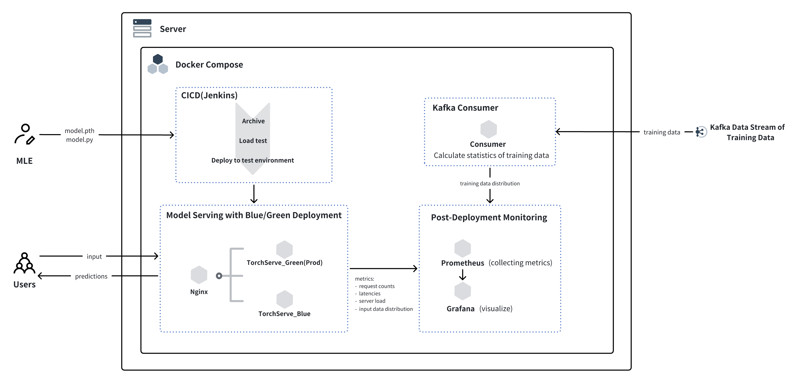
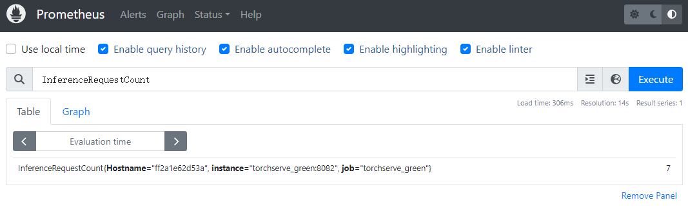

## Introduction

This Project is about building a dockerized infrastructure on a single node HTTP server to automate serve and monitor a simple machinel learning model.



## Contents

- `assets/`: images and screenshots
- `config/`：
  - `nginx/`: config file for nginx for blue green deployment
  - `grafana/` : config files for Grafana
    - `datasource.yml`
  - `prometheus/`: config files for Prometheus
    - `prometheus.yml`: monitor targets config, mounted in docker
    - `alert_rules.yml`: alerts rules config, mounted in docker
  - `settings.xml`: metrics SLA, user settings 
- `emulator/`: simulate user input, and kafka topic producing training data
  - `kafka/`: topic producing training data for subscription
  - `locust/`: scripts to simulate user input and test api performace
- `scripts/`: automate scripts e.g.swap deploy enviroment
- `torchserve/`: models and torchserve configs
  - `model.py`: model structures(MLE deliverables)
  - `model.pth`: model parameters(MLE deliverables)
  - `model_store`: archived model for torchserve
  - `metrics.yaml`：metrics collected by torchserve and consumed by prometheus
  - `config.properties`: configs for torchserve
- `docker-compose.yml`：Dockers for torchserve, nginx, prometheus, grafana etc.


## Getting Started

1. install toolkits
    ```
    install_docker.sh
    install git
    git clone
    ```


1. Configure user settings

    edit config.yaml ---- 

2. To get everything all set:

    ```
    docker-compose up -d
    ```
    In this stage docker will:
    - 
    - 

3. check if services are built:
    ```
    docker ps
    ```

4. Once Setup, if a git repo and credential is configured, commit model.py and model.pth to the designated repo will trigger automated workflow for build  test and deploy. Alternatively, follow the following steps to set up manually, to deploy a model first in a blue environment

5. Upload model.py, model.pth to ./torchserve/models, then archive model:
    ```
    cd ./models
    torch-model-archiver --model-name <model name> --version 1.0 --model-file model.py --serialized-file model.pth --handle handler.py --export-path model_store
    ```

6. register model in torchserve and assign resouces:
    ```
    #check exsiting models
    curl http://localhost:8001/models     

    # register model
    curl -X POST "http://localhost:9001/models?url=<your_model.mar>&model_name=<model name>"

    # assgin resources
    curl -X PUT "http://localhost:9001/models/<model name>?min_worker=1&max_worker=1"

    ```
    once the above steps are down, model is ready for serving

7. Use model inference API to predict:
    ```
    <!-- docker run --rm -it -p 8080:8080 -p 8081:8081 -p 8082:8082 -v ./model_store:/model_store pytorch/torchserve torchserve --model-store=/model_store --disable-token-auth
     -->
    curl -X POST http://localhost:9000/predictions/<model name> -H "Content-Type: application/json" -d '{"data": [4.0,6.0]}'

    ```
8. Check qps load and latency:
    ```
    test qps 
    sudo apt install apache2-utils

    ab -n 1000 -c 100 ttp://localhost:9000/predictions/<model name>
    这里，-n 1000 表示发送 1000 个请求，-c 100 表示使用 100 个并发请求，尽量维持目标 QPS。
    ```

9. If feeling good about the model, deploy it in prod environment
    ```
    # register model
    curl -X POST "http://localhost:8001/models?url=<your_model.mar>&model_name=<model name>"

    # assgin resources
    curl -X PUT "http://localhost:8001/models/<model name>?min_worker=1&max_worker=1"

    ```

10. Use api 
    ```
    curl -X POST http://localhost/predict -H "Content-Type: application/json" -d '{"data": [4.0,6.0]}'

    ```

11. check metrics and alers on Prometheus
    
    

    

11. Update Model or Rollback

    ```
    #update nginx config


    ```
    after config changed, update nginx with 
    ```
    docker-compose exec nginx nginx -s reload
    ```


docker torchserve
```
docker run --rm -it -p 8080:8080 -p 8081:8081 -v $PWD/model_store:/model_store pytorch/torchserve torchserve --model-store=/model_store --disable-token-auth
```


```
check exsiting models
curl http://localhost:8001/models 
```


chmod 644 ./models/config.properties
chmod 644 ./models/metrics.yaml


docker run --rm -it -p 8080:8080 -p 8081:8081 -v $PWD/model_store:/model_store pytorch/torchserve:latest torchserve --model-store ./model_store --models model=model1.mar --ncs


curl -H "Authorization: Bearer TvN_lu9W" http://localhost:8081/models


docker ps
docker exec -it <containerid> /bin/bash
       docker exec -it 3af2a3c4e3b9 /bin/bash


manage:
curl http://localhost:8001/models 
curl -X POST "http://localhost:8001/models?url=model1.mar&model_name=model1"
curl -X PUT "http://localhost:8001/models/model1?min_worker=1&max_worker=1"

inference:
curl -X POST http://localhost:8000/predictions/model0 -H "Content-Type: application/json" -d '{"data": [1, 2]}'

nginx:
curl -X POST http://localhost:/predictions/model1 -H "Content-Type: application/json" -d '{"data": [1, 2]}'


配置nginx后更新
docker-compose exec nginx nginx -s reload


torch-model-archiver --model-name model3 --version 1.0 --model-file model.py --serialized-file model.pth --handle handler.py --export-path model_store


curl -X POST "http://localhost:8001/models?url=model0.mar&model_name=model0"
curl -X PUT "http://localhost:8001/models/model0?min_worker=1&max_worker=1"

curl -X POST http://localhost:8000/predictions/model0 -H "Content-Type: application/json" -d '{"data": [4.0, 6.0]}'

docker-compose logs --tail=25 torchserve_green

curl -X POST http://localhost/predict -H "Content-Type: application/json" -d '{"data": [4.0, 6.0]}'


curl -X POST "http://localhost:8001/models?url=model3.mar&model_name=model3"
curl -X PUT "http://localhost:8001/models/model3?min_worker=1&max_worker=1"
curl -X POST http://localhost:8000/predictions/model3 -H "Content-Type: application/json" -d '{"data": [4.0, 6.0]}'

curl -X POST "http://localhost:9001/models?url=model1.mar&model_name=model1"
curl -X PUT "http://localhost:9001/models/model1?min_worker=1&max_worker=1"
curl -X POST http://localhost:9000/predictions/model3 -H "Content-Type: application/json" -d '{"data": [4.0, 6.0]}'


curl -X POST "http://localhost:8001/models?url=modelnew.mar&model_name=modelnew"
curl -X PUT "http://localhost:8001/models/modelnew?min_worker=1&max_worker=1"
curl -X POST http://localhost:8000/predictions/modelnew -H "Content-Type: application/json" -d '{"data": [1.0, 1.0]}'


torch-model-archiver --model-name mnist --version 1.0 --model-file examples/image_classifier/mnist/mnist.py --serialized-file examples/image_classifier/mnist/mnist_cnn.pt --handler examples/custom_metrics/mnist_handler.py

scp -i .\SiyuEC2.pem  "C:/Users/Neil/Downloads/mnist_cnn.pt" ubuntu@34.229.122.114:/home/ubuntu/mlops/models/test


jenkins自动测qps
配置rate limiting
模拟输入错误
back up access log


docker run -d -p 8089:8089 mylocust


to tesk the api:
get host ip 

```
ip route | grep default
default via 172.31.16.1 dev enX0 proto dhcp src 172.31.20.55 metric 10
```
edit Dockerfile under /lucost
replace with localhost ip

Build image
docker build - t locust_api_test .
docker run -p 8089:8089 -d locust_api_test


grafana 


(sum(Requests2XX[5m]))
/
(sum(rate(Requests4XX[5m])) * 100

torch-model-archiver --model-name mnist --version 1.0 --model-file mnist.py --serialized-file mnist_cnn.pt --handler mnist_handler.py

curl -X DELETE http://localhost:8001/models/modelnew
curl -X POST "http://localhost:8001/models?url=modelnew.mar&model_name=modelnew"
curl -X PUT "http://localhost:8001/models/modelnew?min_worker=1&max_worker=1"

? curl -X POST "http://localhost:8001/models/modelnew?reload=true"


curl -X POST "http://localhost:8001/models?url=mnist.mar&model_name=mnist"
curl -X PUT "http://localhost:8001/models/mnist?min_worker=1&max_worker=1"


torch-model-archiver --model-name modelnew --version 1.0 --model-file model.py --serialized-file model.pth --handle handler.py --export-path model_store
