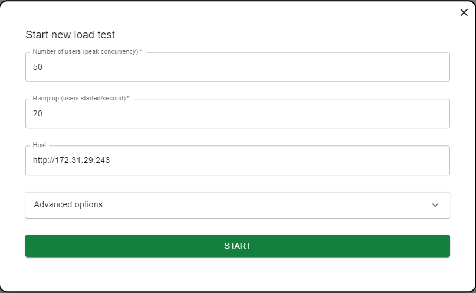
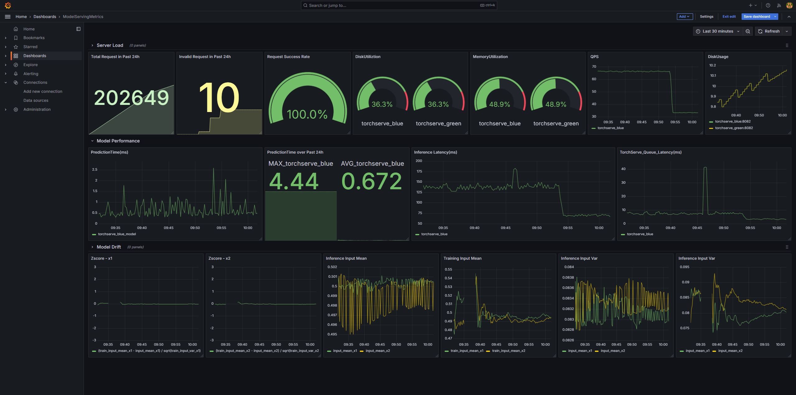

## Introduction

This project is about build a dockerized infrastructure on a single node HTTP server to serve and monitor a simple machinel learning model.


<div style="clear: both;"></div>


## Contents

- `assets/`: screenshots.
- `config/`: config files mounted in Docker volume.
  - `grafana/`: config file for grafana.
    - `dashabords\`: pre-build grafana dashboards in json.
    - `datasource.yml`: define data sources from prometheus.
    - `dashboards.yml`: define databoard path.
  - `prometheus/`: config files for Prometheus.
    - `prometheus.yml`: define datasources.
    - `alert_rules.yml`: define alertings.
- `jenkins/`: pipeline script to automate deployment.
- `simulator/`: simulate user input, and kafka topic producing training data.
  - `kafka_producer/`: kafka data streaming of training data.
  - `kafka_consumer/`: scripts to consume training data from kafka and feed into prometheus for model-drift detection.
  - `locust/`: generate user inputs to the model api in test enviroment.
- `nginx/`: nginx config for blue green deployment and Dockerfile.
- `scripts/`: automate scripts e.g.swap deploy enviroment.
- `torchserve/`: models and torchserve configs.
  - `model.py`: mle delivery of model structure.
  - `model.pth`: mle delivery of model parameters.
  - `model_store`: archived model for torchserve.
  - `metrics.yaml`：metrics logged by torchserve and consumed by prometheus.
  - `config.properties`: configs for torchserve.
- `docker-compose.yml`：Dockers for torchserve, nginx, prometheus, grafana etc.


## Getting Started

1. **Preparation**
    - Install Docker(if needed)
    ```
    $ ./scripts/install_docker.sh
    ```
    - Make sure model deliverables model.py and model.pth are under model_serve_infra/torchserve/

2. **To get everything all set**:

    ```
    $ docker-compose up -d
    ```
    In this stage docker will:
    - Create two torchserve instance serving the models and logging the metrics simutaneously
    - Create an nginx to handle incoming traffic and choose which torchserve instance for blue green deployment
    - Create a node exporter for prometheus to monitor the server itself
    - Create a prometheus instance to collect metrics
    - Create a grafana instance with pre-build dashboards to visualize metrics
    - Create a kafka consumer to ingest training data and calculate the statistics for model-drift detection
    - Create a locust instance to perform load test of the torchserve api

3. **Check if services are built:**
    ```
    $ docker-compose ps

    >NAME                                   IMAGE                           COMMAND                  SERVICE            CREATED       STATUS             PORTS
    model_serve_infra-grafana-1            grafana/grafana                 "/run.sh"                grafana            2 hours ago   Up About an hour   0.0.0.0:3000->3000/tcp, :::3000->3000/tcp
    model_serve_infra-locust-1             locustio/locust                 "locust -f /locust-t…"   locust             2 hours ago   Up 59 minutes      5557/tcp, 0.0.0.0:8089->8089/tcp, :::8089->8089/tcp
    model_serve_infra-nginx-1              nginx                           "/docker-entrypoint.…"   nginx              2 hours ago   Up About an hour   0.0.0.0:80->80/tcp, :::80->80/tcp
    model_serve_infra-torchserve_blue-1    pytorch/torchserve:0.12.0-cpu   "/usr/local/bin/dock…"   torchserve_blue    2 hours ago   Up About an hour   7070-7071/tcp, 0.0.0.0:9000->8080/tcp, [::]:9000->8080/tcp, 0.0.0.0:9001->8081/tcp, [::]:9001->8081/tcp, 0.0.0.0:9002->8082/tcp, [::]:9002->8082/tcp
    model_serve_infra-torchserve_green-1   pytorch/torchserve:0.12.0-cpu   "/usr/local/bin/dock…"   torchserve_green   2 hours ago   Up About an hour   7070-7071/tcp, 0.0.0.0:8000->8080/tcp, [::]:8000->8080/tcp, 0.0.0.0:8001->8081/tcp, [::]:8001->8081/tcp, 0.0.0.0:8002->8082/tcp, [::]:8002->8082/tcp
    node_exporter                          prom/node-exporter              "/bin/node_exporter"     node_exporter      2 hours ago   Up About an hour   0.0.0.0:9100->9100/tcp, :::9100->9100/tcp
    prometheus                             prom/prometheus                 "/bin/prometheus --c…"   prometheus         2 hours ago   Up About an hour   0.0.0.0:9090->9090/tcp, :::9090->9090/tcp
    ```
4. **Inference at test api `http://localhost/test/predict`**
    ```
    $ curl -X POST http://localhost/test/predict -H "Content-Type: application/json" -d '{"data": [0.2,0.6]}'

    > {
    "output": 0.6496530771255493
    }

    ```

5. **(Optional) ssh to the server to use web UI from local PC if running a server on a virtual machine like EC2**
    ```
     $ ssh -L 9090:localhost:9090 -L 3000:localhost:3000 -L 8089:localhost:8089 username>@hostname -i your_ssh_key.pem

     # port 9090 for Prometheus
     # port 3000 for Grafana
     # port 8089 for Locust
    ```

6. **Start a simulator to generate user input and perform load test**

    - Open a browser and visit localhost:8089
    
    - Replace with your host ip, config num of users and start load test 

    
    <div style="clear: both;"></div>

    - Visit localhost:3000 on local browser to view monitoring metrics on Grafana, login with:
        - `user: admin`
        - `password: grafana`
    
        In addition to server load and software performance metrics, to simulate model drift detection, there's a kafka simulator under `./simulator/kafka_producer` producing training data x1,x2 and a consumer under `./kafka_consumer` to consume the data and calculate mean and variance incrementally
        
        To run kafka producer, run: `docker-compose -f ./simulator/kafka_producer/docker-compose.yaml up -d`
        
        Create kafka topic by `docker-compose -f ./simulator/kafka_producer/docker-compose.yaml exec -it kafka kafka-topics.sh --bootstrap-server localhost:9092 --create --topic trainingdata`
        
        To run kakfa consumer and feed metrics into prometheus, run `./simulator/kafka_consumer/install_and_run.sh`

        For ubuntu somehow `host.docker.internal` cannot be refered to hostip :(, consumer is not running in docker and training data metrics target address in `./config/prometheus/prometheus.yml` has to be manually set and restart docker if needed by docker-compose restart prometheus

        Z-score of input feature x1 and x2 are calculated on Grafana together with other monitoring metrics

    
    <div style="clear: both;"></div>


7. **Once the application is functioning correctly, update the Nginx configuration to serve the production API**

    Stop the simulators, swap deploy environment:

    ```
    $ docker-compose -f ./simulator/kafka_producer/docker-compose.yaml down

    $ chmod +x ./scripts/swap_deploy.sh
    $ ./scripts/swap_deploy.sh

    ```

    This script will change the route path to the other environment and trigger a reload of Nginx configuration without disrupting active connections, this step can also performed under a model rollback scenario

    Then use production api for serving `http://localhost/predict` :
    ```
    $ curl -X POST http://localhost/predict -H "Content-Type: application/json" -d '{"data": [0.2,0.6]}'
    ```
8. **Log Management**:

    Option 1: Use logrotate and cron inside the Nginx Docker container, may consume more resources and cause negative impact to serving latency.

    Option 2: Mount Nginx logs to host machine and use logrotate there, but need manual setup, would be better in this case

        ```
        sudo apt-get install -y logrotate cron 
        sudo nano /etc/logrotate.d/nginx

        /home/ubuntu/nginx/logs/*.log {
            size 1M                  #for file size over 1M
            daily                    # run daily          
            missingok                # allow log not exist
            rotate 7                 # keep 7 days log
            compress                 # 
            delaycompress            # not compressing latest
            notifempty               # skip empty logs
            create 0640 root root    # 
            postrotate
                docker-compose exec nginx nginx -s reload
            endscript
        }

        sudo crontab -e
        0 0 * * * /usr/sbin/logrotate /etc/logrotate.conf
        ```

        check logs by 
        ```
        $ ls /var/log/nginx/

        # access logs are splited into prod api and test api in nginx confgi

        > access.log  error.log  prod_access.log  prod_access.log.1  test_access.log
        ```


10. **Model Update and CICD**

    - Upload new model file(model.py, model.pth) to ./model_serve_infra/torchserve/
    - Check which instance is running in production
        ```
        $ chmod +x ./scripts/which_is_production.sh
        $ ./scripts/which_is_production.sh

        > production is GREEN
        ```
    - Archive model on the other instance using torchserve api, if producntion is green, then:

        ```
        docker-compose exec torchserve_blue torch-model-archiver --model-name <model_name> --version 1.0 --model-file /home/model-server/<model_name>.py --serialized-file /home/model-server/<model_name>.pth --handler /home/model-server/handler.py --export-path /home/model-server/model-store/blue
        ```

    - Register and serve the model

        - Use port 9001 for torchserve blue model management `localhost:9001/models`
        - use port 8001 for torchserve green model management `localhost:8001/models`

        ```
        # register model by torchserve api
        $ curl -X POST "http://localhost:9001/models?url=<model_name>.mar&model_name=<model name>"

        # assign resources
        $ curl -X PUT "http://localhost:9001/models/<model_name>?min_worker=1&max_worker=1"
        ```

        Edit Nginx config to make sure the route path align with the new model name.
    
    - Repeat step 5,6 and 7

    Above steps are automated with `./jenkins/pipeline.groovy`

    
    <div style="clear: both;"></div>


## Other Toughts

In the real world, CI/CD can start when an MLE submits training jobs, and perform train, test, registry, and deploy. Ideally this HTTP server will receive handover from a model registry server and start to deploy, so it’s better to have a Jenkins instance serving as a slave node or a GitLab runner to take part in the CI/CD pipeline instead of managing CICD pipeline. the `pipeline.groovy` under `./jenkins` can be integrated into a main pipeline script.

### Jenkins vs GitLab:

**Jenkins:**  ✔
- High compatibility, can receive webook from registry tool e.g. MLflow while gitlab cannot. `:)`
- Old UI, complex setup, have to manage plugins and slave nodes  `:(`

**GitLab:**
- Clear yaml syntax, easy management. `:)`
- Smooth experience in code review with pipeline results `:)`
- Can only integrate with Git repositories, limiting its use cases. `:(`

If the workflow is stable, then gitlab provides better user experience, but jenkins could be better to handle more uncertainty in future.

--- 

### TorchServe vs FastAPI

They can both take advantage of multi processing and ensure scalability, but have some fundamental differences. Below are prons and cons for each and a simple test result for performance

**TorchServe:** ✔
- Focus on torch model serving, synchronous, but optimized by taking advantage of queue and batch processing `:)`
- Pre-configured tools for metrics logging, reducing the need for custom development. `:)`
- Confident to handle further complex models in future.
- Designated for pytorch`:(`

 **FastAPI:**
- Focus on handle http request, asynchronous, good for I/O intensive task `:)`, but not for inference acceleration `:(`
- Easy deployment `:)`
- Can be used for different model type e.g. torch scikit learn and tensorflow`:)`

Here's a test with simplemodel on EC2 t2.micro to compare performance differences

**Under 1000 requests by 100 concurrent users:**

  - FastAPI

    Requests per second: 1332.13 (mean)  
    Time per request: 75.068 ms (mean)  
    Time per request (all requests)**: 0.751 ms (mean across all concurrent requests)

    | Percentile | 50%  | 66%  | 75%  | 80%  | 90%  | 95%  | 98%  | 99%  | 100% (Longest Request) |
    |------------|------|------|------|------|------|------|------|------|------------------------|
    | Time (ms)  | 74   | 81   | 82   | 84   | 92   | 104  | 106  | 106  | 108                    |

    **50% of requests** were served within **74 ms**.

    **90% of requests** were served within **92 ms**.

    The **longest request** took **108 ms**.

  - TorchServe

    Requests per second: 1645.63 (mean)  
    Time per request**: 60.767 ms (mean)  
    Time per request (all requests)**: 0.608 ms (mean across all concurrent requests)

    | Percentile | 50%  | 66%  | 75%  | 80%  | 90%  | 95%  | 98%  | 99%  | 100% (Longest Request) |
    |------------|------|------|------|------|------|------|------|------|------------------------|
    | Time (ms)  | 60   | 74   | 79   | 83   | 93   | 102  | 113  | 117  | 124                    |

    **50% of requests** were served within **60 ms**.

    **90% of requests** were served within **93 ms**.

    The **longest request** took **124 ms**.

---
Under light weight traffic, their performance are similiar to each other

---

**Under 10,000 requests by 200 concurrent users:**

- FastAPI

    Requests per second: 1005.52 (mean)  
    Time per request: 198.903 ms (mean)  
    Time per request (all requests): 0.995 ms (mean across all concurrent requests)

    | Percentile | 50%  | 66%  | 75%  | 80%  | 90%  | 95%  | 98%  | 99%  | 100% (Longest Request) |
    |------------|------|------|------|------|------|------|------|------|------------------------|
    | Time (ms)  | 196  | 209  | 214  | 218  | 240  | 265  | 281  | 287  | 324                    |

    **50% of requests** were served within **196 ms**.

    **90% of requests** were served within **240 ms**.

    The **longest request** took **324 ms**.


- TorchServe

    Requests per second**: 3302.70 (mean)  
    Time per request**: 60.556 ms (mean)  
    Time per request (all requests)**: 0.303 ms (mean across all concurrent requests)  
    **Failed requests**: 9087

    | Percentile | 50%  | 66%  | 75%  | 80%  | 90%  | 95%  | 98%  | 99%  | 100% (Longest Request) |
    |------------|------|------|------|------|------|------|------|------|------------------------|
    | Time (ms)  | 26   | 33   | 38   | 41   | 61   | 370  | 416  | 433  | 509                    |


    **50% of requests** were served within **26 ms**.

    **90% of requests** were served within **61 ms**.

    The **longest request** took **509 ms**.

---

When traffic increase, they act differently

FASTAPI shows high stablity with 0 failed request and latency time are evently distributed, since each request is processed in a asynchronized way

TorchServe shows high performance P90 latency 60ms, but the other 10 request may casue high latency, and may fail, since most concurrent requests get batch processed.


##### FASTAPI under 1000 request by 100 concurrent users

    Server Software:        uvicorn

    Requests per second:    1332.13 [#/sec] (mean)
    Time per request:       75.068 [ms] (mean)
    Time per request:       0.751 [ms] (mean, across all concurrent requests)


    | Percentile | 50%  | 66%  | 75%  | 80%  | 90%  | 95%  | 98%  | 99%  | 100% (Longest Request) |
    |-------------|------|------|------|------|------|------|------|------|------------------------|
    | Time (ms)   | 74   | 81   | 82   | 84   | 92   | 104  | 106  | 106  | 108                    |

- **50%** of requests were served within **74 ms**.
- **90%** of requests were served within **92 ms**.
- The **longest request** took **108 ms**.


#### TorchServe under 1000 request by 100 concurrent users
    Server Software:        torchserve

    Requests per second:    1645.63 [#/sec] (mean)
    Time per request:       60.767 [ms] (mean)
    Time per request:       0.608 [ms] (mean, across all concurrent requests)

    | Percentile | 50%  | 66%  | 75%  | 80%  | 90%  | 95%  | 98%  | 99%  | 100% (Longest Request) |
    |-------------|------|------|------|------|------|------|------|------|------------------------|
    | Time (ms)   | 60   | 74   | 79   | 83   | 93   | 102  | 113  | 117  | 124                    |

- **50%** of requests were served within **60 ms**.
- **90%** of requests were served within **93 ms**.
- The **longest request** took **124 ms**.

Under light weight traffic, their performance are similiar to each other

##### FASTAPI under 10000 request by 200 concurrent users

    Requests per second:    1005.52 [#/sec] (mean)
    Time per request:       198.903 [ms] (mean)
    Time per request:       0.995 [ms] (mean, across all concurrent requests)

    | Percentile  | 50%   | 66%  | 75%  | 80%  | 90%  | 95%  | 98%  | 99%  | 100% (Longest Request) |
    |-------------|-------|------|------|------|------|------|------|------|------------------------|
    | Time (ms)   | 196   | 209  | 214  | 218  | 240  | 265  | 281  | 287  | 324                    |

- **50%** of requests were served within **196 ms**.
- **90%** of requests were served within **240 ms**.
- The **longest request** took **324 ms**.


#### TorchServe under 10000 request by 200 concurrent users
    
    Requests per second:    3302.70 [#/sec] (mean)
    Time per request:       60.556 [ms] (mean)
    Time per request:       0.303 [ms] (mean, across all concurrent requests)
    Failed requests:        9087

    | Percentile | 50%  | 66%  | 75%  | 80%  | 90%  | 95%  | 98%  | 99%  | 100% (Longest Request) |
    |-------------|------|------|------|------|------|------|------|------|------------------------|
    | Time (ms)   | 26   | 33   | 38   | 41   | 61   | 370  | 416  | 433  | 509                    |

---
When traffic increase, they act differently

FASTAPI shows high stablity with latency time relatively evently distributed, since each request is processed in a asynchronized way

TorchServe shows high performance with P90 latency 60ms, but the other 10 request may casue high latency, since most concurrent requests get batch processed.

